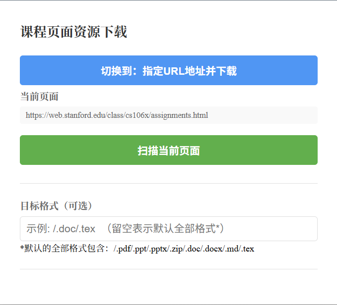
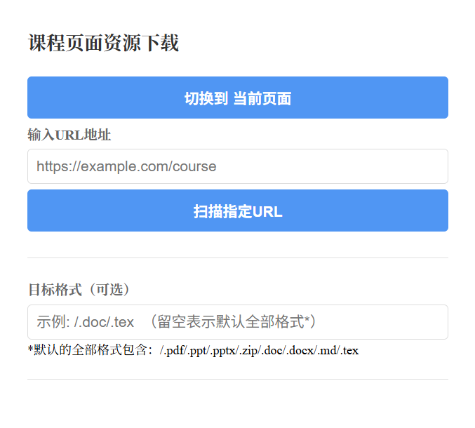

# CSDIY_auto_resource_downloader（CARD, 课程资源下载助手）

这是一个由Claude 4.5 Sonnet辅助之下完成的Edge浏览器配套插件，能够实现对包括但不限于cc98页面、csdiy指南涉及到的部分课程资源网页（目前已经测试了UCB CS70, CS188, Stanford CS106L/X等课程官网）下的PDF,PPT,PPTX,`.zip`,`.doc`,`.docx`,`.md`,`.tex`等格式资源一键提取，可以节省一定的时间.

## Getting Started

下载Releases中`.zip`压缩包并解压到合适的文件夹中. 使用Edge开发者模式，在地址栏中输入`edge://extensions`，选择`加载解压缩的扩展`，选中文件夹放置路径并启用插件.

## Commit History

### v1.0 初始化

支持解压缩之后放置在选定路径，使用Edge扩展实现功能.

目前支持的文件抓取逻辑：页面下载超链接直接以`.pdf`等格式为后缀.

操作面板：（以CS106X资源官网为例）

支持对当前界面文档的一键提取：

点击“扫描当前页面”之后可以获取所有资源文档下载链接，支持指定文件后缀名：

点击下载后，所有资源会放置在默认下载路径下以`/resources_downloads/hostname+extendname`命名的文件夹中.

TODO：

* 识别MIT OCW的课件，需要Javascript功能函数迭代访问网址一次再下载；抓取CS61C的slides（存放在Google云盘中），暂未解决；
    列一下自己的思路以免之后忘掉：
    F12可以看到所有目标文件是以url导航形式存放的，所以只抓取`<main id="course-content-section">`中形如`<a href="/courses/6-006-introduction-to-algorithms-spring-2020/resources/mit6_006s20_lec1">Lecture 1: Introduction notes (PDF)</a>`的部分并逐个访问，迭代这个函数本身1次实现对目标文件的下载.
* 修复指定URL下载功能的bug，目前一直报错为`无法访问URL: DOMParser is not defined`，还在修复中.
